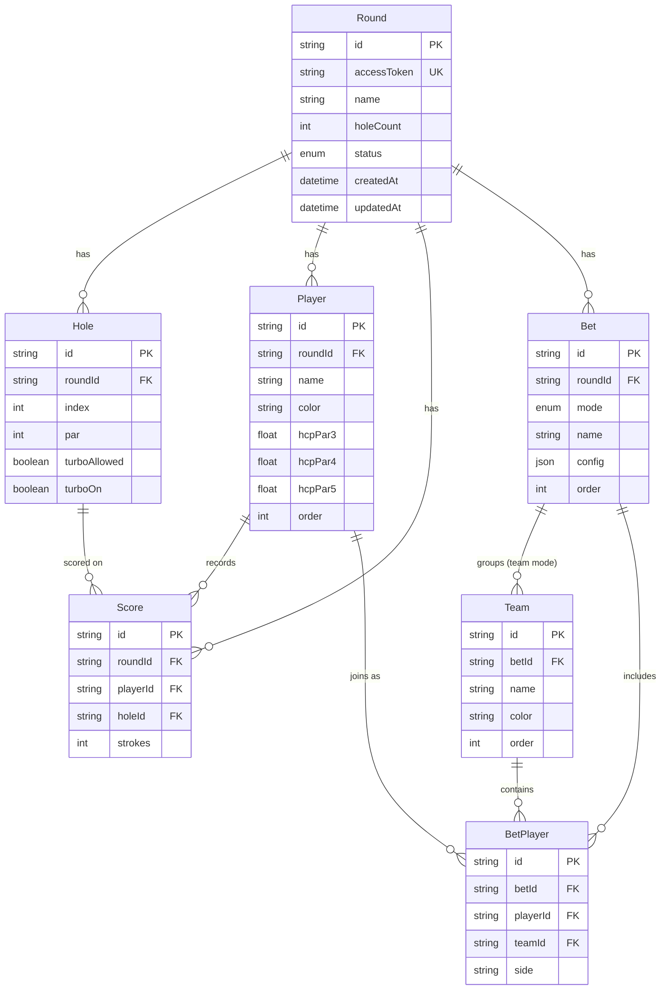

# 03 — Database Schema

**Project:** YorDor
**Version:** 0.1 (draft)
**Last updated:** 2026-06-20
**Stack:** Prisma + PostgreSQL (Railway)

> หลักออกแบบ: **ผู้เล่นและกติกาผูกกับรอบ (per-round)** ไม่มี identity ถาวรข้ามรอบใน v1
> **สกอร์เก็บที่ระดับรอบ** (ใช้ร่วมทุกเดิมพัน) ส่วน "เดิมพัน (Bet)" อ้างถึงสกอร์เดียวกัน → เพิ่ม bet layer ได้โดยไม่กรอกสกอร์ซ้ำ
> ผลการคำนวณ (totals/matrix) **ไม่เก็บถาวร** — engine คำนวณ on-the-fly จาก source data (เก็บ snapshot เฉพาะตอน finalize ถ้าต้องการ — ดู §6)

---

## 1. Design Principles

1. **Round = aggregate root** ทุกอย่าง (players, holes, scores, bets) อยู่ใต้รอบเดียว
2. **Scores แยกจาก Bets** — สกอร์เป็นข้อเท็จจริงของรอบ, เดิมพันเป็นมุมมองการคิดแต้ม
3. **Bet เป็น polymorphic เบาๆ** — มี `mode` + `config` (Json) + ผู้เข้าร่วม รองรับเพิ่มโหมดใหม่โดยไม่ต้อง migrate ตารางหลัก
4. **Guest-first** — เข้าถึงรอบผ่าน `accessToken` (ลิงก์/อุปกรณ์) ยังไม่มี User account (เผื่อ field ไว้ใน §7)
5. **Deterministic source** — เก็บเฉพาะ input ที่จำเป็นต่อการ reproduce ผลลัพธ์

---

## 2. ER Diagram



---

## 3. Prisma Schema

```prisma
// schema.prisma
generator client {
  provider = "prisma-client-js"
}

datasource db {
  provider = "postgresql"
  url      = env("DATABASE_URL")
}

enum RoundStatus {
  SETUP
  PLAYING
  FINISHED
}

enum BetMode {
  TEAM      // Best N round-robin
  MATCH     // 1-vs-1 (match-style หรือ stroke-style ตาม config)
  STROKE    // เดี่ยว round-robin
  HIGHLOW   // บ๊วยจ่ายหัว รายหลุม
  // SKIN   // roadmap
}

model Round {
  id          String      @id @default(cuid())
  accessToken String      @unique @default(cuid())  // ลิงก์ guest
  name        String      @default("")
  holeCount   Int         @default(18)
  status      RoundStatus @default(SETUP)
  createdAt   DateTime    @default(now())
  updatedAt   DateTime    @updatedAt

  holes   Hole[]
  players Player[]
  scores  Score[]
  bets    Bet[]

  @@index([accessToken])
}

model Hole {
  id           String  @id @default(cuid())
  roundId      String
  index        Int     // 0..holeCount-1
  par          Int     @default(4)   // 3 | 4 | 5
  turboAllowed Boolean @default(false)
  turboOn      Boolean @default(false)

  round  Round   @relation(fields: [roundId], references: [id], onDelete: Cascade)
  scores Score[]

  @@unique([roundId, index])
  @@index([roundId])
}

model Player {
  id      String @id @default(cuid())
  roundId String
  name    String
  color   String @default("#1B5E20")
  hcpPar3 Float  @default(0)
  hcpPar4 Float  @default(0)
  hcpPar5 Float  @default(0)
  order   Int    @default(0)

  round      Round       @relation(fields: [roundId], references: [id], onDelete: Cascade)
  scores     Score[]
  betPlayers BetPlayer[]

  @@index([roundId])
}

model Score {
  id       String @id @default(cuid())
  roundId  String
  playerId String
  holeId   String
  strokes  Int    // gross; ยังไม่กรอก = ไม่มี row (null = ไม่มีแถว)

  round  Round  @relation(fields: [roundId], references: [id], onDelete: Cascade)
  player Player @relation(fields: [playerId], references: [id], onDelete: Cascade)
  hole   Hole   @relation(fields: [holeId], references: [id], onDelete: Cascade)

  @@unique([playerId, holeId])
  @@index([roundId])
  @@index([holeId])
}

model Bet {
  id      String  @id @default(cuid())
  roundId String
  mode    BetMode
  name    String  @default("")
  config  Json    @default("{}")   // shape ตามโหมด — ดู §4
  order   Int     @default(0)

  round   Round       @relation(fields: [roundId], references: [id], onDelete: Cascade)
  teams   Team[]
  players BetPlayer[]

  @@index([roundId])
}

model Team {
  id    String @id @default(cuid())
  betId String
  name  String
  color String @default("#1B5E20")
  order Int    @default(0)

  bet     Bet         @relation(fields: [betId], references: [id], onDelete: Cascade)
  members BetPlayer[]

  @@index([betId])
}

model BetPlayer {
  id       String  @id @default(cuid())
  betId    String
  playerId String
  teamId   String? // set เฉพาะ TEAM mode
  side     String? // "A" | "B" เฉพาะ MATCH mode

  bet    Bet     @relation(fields: [betId], references: [id], onDelete: Cascade)
  player Player  @relation(fields: [playerId], references: [id], onDelete: Cascade)
  team   Team?   @relation(fields: [teamId], references: [id], onDelete: SetNull)

  @@unique([betId, playerId])
  @@index([betId])
  @@index([playerId])
}
```

---

## 4. `Bet.config` shape ต่อโหมด

เก็บเป็น Json — กำหนด TypeScript type คู่กับ tRPC (ดู `04_API_DESIGN.md`)

```ts
type TeamConfig = {
  bestN: 1 | 2;            // v1 รองรับ Best1+Best2 (=2)
  bonus: boolean;          // default true
};

type MatchConfig = {
  method: "holes" | "stroke";   // match-style | stroke-style
  basis: "net" | "gross";       // default "net"
  bonus: boolean;               // default false (holes), n/a (stroke)
  pointPerStroke: number;       // เฉพาะ method "stroke", default 1
};

type StrokeConfig = {
  basis: "net" | "gross";       // settlement ใช้อันนี้ (leaderboard โชว์ทั้งคู่)
  pointPerStroke: number;       // default 1
};

type HighLowConfig = {
  basis: "net" | "gross";       // default "net"
  bonus: boolean;               // default false
  pointPerHead: number;         // บ๊วยจ่ายหัวกี่ point/คู่, default 1
};

// turbo อยู่ที่ Hole (turboOn) — bet เลือก "ใช้ turbo ไหม" ผ่าน:
type CommonConfig = { useTurbo: boolean }; // default true; ถ้า false bet นี้ไม่สน turboOn
```

> ทุก config มี `useTurbo` ผสมเข้าไป (intersection) — bet เปิด/ปิด turbo ของตัวเองได้ตามข้อ §7 ใน `01`

---

## 5. ตัวอย่างข้อมูล (1 รอบ มี 2 เดิมพันซ้อน)

```
Round  (id=r1, holeCount=18, status=PLAYING)
 ├ Players: Som, Lek, Joe, Kan
 ├ Holes:   18 แถว (par/turbo ต่อหลุม)
 ├ Scores:  Som×18, Lek×18, ... (กรอกร่วมกัน)
 ├ Bet#1 (TEAM):  teams=[A:{Som,Lek}, B:{Joe,Kan}], config={bestN:2,bonus:true,useTurbo:true}
 └ Bet#2 (MATCH): BetPlayer=[Som side A, Joe side B], config={method:"holes",basis:"net",useTurbo:false}
```

Som กับ Joe มีทั้งแต้มทีม (Bet#1) และแมตช์ส่วนตัว (Bet#2) บนสกอร์ชุดเดียว

---

## 6. ผลการคำนวณ (results) — เก็บหรือไม่?

- **v1 default: ไม่เก็บ** — คำนวณจาก engine ทุกครั้งที่ render (source data เล็ก เร็วพอ)
- **ตอน FINISHED:** อาจ snapshot ผลลง `BetResult` (Json) เพื่อ freeze ไม่ให้เพี้ยนถ้าแก้สูตรภายหลัง

ถ้าต้องการ snapshot (optional, เพิ่มทีหลังได้):
```prisma
model BetResult {
  id        String   @id @default(cuid())
  betId     String   @unique
  totals    Json     // { [playerId|teamId]: points }
  matrix    Json     // { [from]: { [to]: points } }
  holeLog   Json
  createdAt DateTime @default(now())
}
```

---

## 7. Guest → Account (เผื่ออนาคต, ไม่ทำใน v1)

- เพิ่ม `User` model + `Round.ownerId String?` (nullable) — รอบ guest = ownerId null
- migration ปลอดภัย เพราะ field เป็น optional
- claim รอบ: ผู้ใช้ login แล้ว set ownerId ของรอบที่ตัวเองสร้างผ่าน accessToken

```prisma
// future
model User {
  id     String  @id @default(cuid())
  email  String  @unique
  rounds Round[]
}
// Round { ownerId String?  owner User? @relation(...) }
```

---

## 8. Constraints & Index สรุป

| ตาราง | unique | index | cascade |
|---|---|---|---|
| Round | accessToken | accessToken | — |
| Hole | (roundId, index) | roundId | round delete → ลบ |
| Score | (playerId, holeId) | roundId, holeId | round/player/hole delete → ลบ |
| BetPlayer | (betId, playerId) | betId, playerId | bet/player delete → ลบ |

> **Null = ยังไม่กรอก:** ไม่มี Score row = ผู้เล่นยังไม่ลงสกอร์หลุมนั้น (สอดคล้อง `02` §9 — net = ⊘)
> **onDelete Cascade** ทำให้ลบรอบเดียวเก็บกวาดทั้งหมด ปลอดภัยกับ guest data
