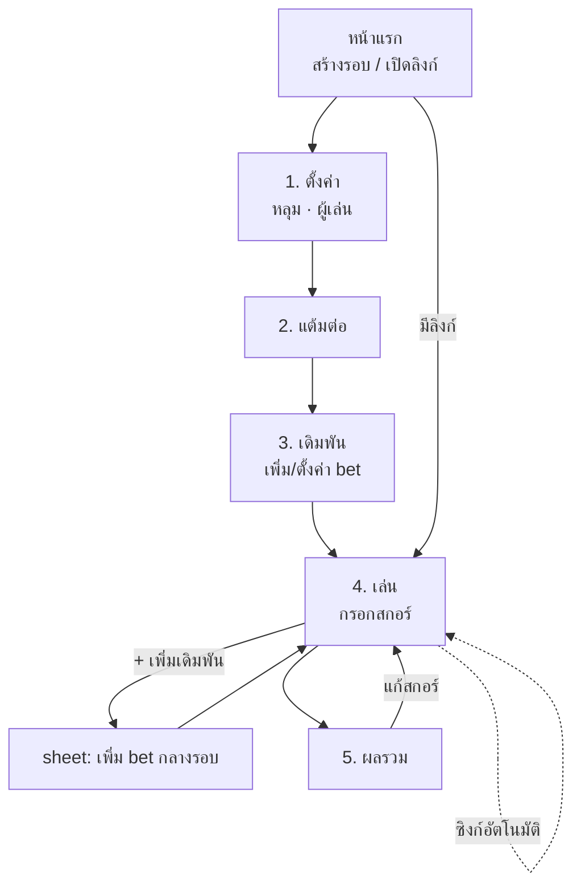

# 05 — UI Flows & Wireframes

**Project:** YorDor
**Version:** 0.1 (draft)
**Last updated:** 2026-06-20
**แนวทาง:** mobile-first (กรอกข้างสนาม), guest, หลาย device ซิงก์อัตโนมัติ

> wireframe เป็น ASCII (low-fi) เน้น layout + ปุ่ม ไม่ใช่ visual final
> สี/โทน: เขียวกอล์ฟ `#1B5E20` + ทอง `#C9A227` + พื้นกระดาษ `#F7F5EF` (ตาม prototype)

---

## 1. Navigation Flow



Stepper (ตาม prototype): `ตั้งค่า → แต้มต่อ → เดิมพัน → เล่น → ผล`
(prototype เดิมไม่มีสเตป "เดิมพัน" — เพิ่มเข้ามาเพราะ multi-mode)

---

## 2. หน้าแรก / สร้างรอบ

```
┌────────────────────────────┐
│  ⛳ YorDor                  │
│  นับแต้มกอล์ฟ หลายโหมด       │
│                            │
│  ┌──────────────────────┐  │
│  │   + สร้างรอบใหม่      │  │  → round.create → /round/{token}
│  └──────────────────────┘  │
│                            │
│  เปิดรอบจากลิงก์            │
│  ┌──────────────────────┐  │
│  │ วางลิงก์/โค้ดรอบ...   │  │  → /round/{token}
│  └──────────────────────┘  │
│                            │
│  รอบล่าสุดในเครื่องนี้       │  (เก็บ token ใน localStorage)
│  • ก๊วนวันอาทิตย์  18 หลุม  │
│  • สนามบางพระ     9 หลุม   │
└────────────────────────────┘
```

---

## 3. ตั้งค่า (Setup)

```
┌────────────────────────────┐
│ 01 ตั้งค่าเกม               │
│ จำนวนหลุม · ผู้เล่น          │
│                            │
│ จำนวนหลุม  [9]  [▣ 18]     │
│                            │
│ ผู้เล่นในรอบ                │   ← v1: รายชื่อกลางรอบ (pool)
│ ┌────────────────────────┐ │     ทีม/คู่ ไปจัดในสเตป "เดิมพัน"
│ │ 1. สมชาย          [✎][×]│ │
│ │ 2. เล็ก            [✎][×]│ │
│ │ 3. โจ              [✎][×]│ │
│ │ 4. กานต์           [✎][×]│ │
│ └────────────────────────┘ │
│ [ + เพิ่มผู้เล่น ]          │
│                            │
│            [ แต้มต่อ → ]    │
└────────────────────────────┘
```

> เปลี่ยนจาก prototype: prototype จับทีมในหน้า setup เลย — v1 แยก "รายชื่อผู้เล่น" (setup) ออกจาก "การจับทีม/คู่" (ไปอยู่ในสเตปเดิมพัน) เพราะคนๆ เดียวอยู่หลาย grouping ได้

---

## 4. แต้มต่อ (Handicap)

```
┌────────────────────────────┐
│ 02 แต้มต่อ (Handicap)       │
│ net = สกอร์จริง + แต้มต่อ    │   ← "ต่อ" บวกเข้า net (ตามกติกาก๊วน)
│ ต่อเยอะ = ได้เปรียบ          │
│                            │
│ ผู้เล่น   Par3  Par4  Par5  │
│ สมชาย    [ 0 ] [ 1 ] [ 2 ] │
│ เล็ก      [ 1 ] [ 2 ] [ 3 ] │
│ โจ        [ 0 ] [ 0 ] [ 1 ] │
│ กานต์     [ 0 ] [ 1 ] [ 1 ] │
│                            │
│ (ใส่ทศนิยมได้ เช่น 0.5)     │
│                            │
│ [ ← กลับ ]   [ เดิมพัน → ]  │
└────────────────────────────┘
```

---

## 5. เดิมพัน (Bets) — สเตปใหม่

```
┌────────────────────────────┐
│ 03 เดิมพัน                  │
│ ใส่ได้หลายเดิมพันในรอบเดียว  │
│                            │
│ ┌────────────────────────┐ │
│ │ ⛳ ทีม (Best 2)    [⚙][×]│ │
│ │ A: สมชาย, เล็ก          │ │
│ │ B: โจ, กานต์            │ │
│ │ Turbo: เปิด · Bonus: เปิด│ │
│ └────────────────────────┘ │
│ ┌────────────────────────┐ │
│ │ ⚔ แมตช์  สมชาย v โจ [⚙][×]│ │
│ │ นับหลุม · net · Turbo:ปิด│ │
│ └────────────────────────┘ │
│                            │
│ [ + เพิ่มเดิมพัน ]          │
│                            │
│ [ ← กลับ ]   [ เริ่มเล่น → ]│
└────────────────────────────┘
```

### Sheet: เพิ่ม/ตั้งค่าเดิมพัน
```
┌────────────────────────────┐
│ เพิ่มเดิมพัน                 │
│ โหมด:                       │
│ [▣ ทีม][ แมตช์ ][สโตรก][บ๊วยจ่ายหัว]
│                            │
│ — ตามโหมดที่เลือก —         │
│ ทีม:  จัดผู้เล่นเข้าทีม      │
│   ┌── Team A ──┐ ┌─ Team B ─┐
│   │ ☑ สมชาย   │ │ ☑ โจ     │
│   │ ☑ เล็ก    │ │ ☑ กานต์  │
│   └──────────┘ └─────────┘
│   Best N: [1][▣2]          │
│   Bonus: [▣] Turbo: [▣]    │
│                            │
│ [ ยกเลิก ]      [ บันทึก ]  │
└────────────────────────────┘
```

config sheet ต่างกันตามโหมด:
- **แมตช์:** เลือก 2 คน + วิธี (นับหลุม/สกอร์รวม) + net/gross + Turbo
- **สโตรก:** เลือกผู้เล่น + ฐาน settle (net/gross) + point/stroke + Turbo
- **บ๊วยจ่ายหัว:** เลือกผู้เล่น + net/gross + point/คู่ + Turbo

---

## 6. เล่น (Play) — มุมมอง "ทีละหลุม" (default)

```
┌────────────────────────────┐
│ [‹]   หลุม 9   [›]          │
│   Par [3][▣4][5]            │
│   ⚡ TURBO ×2  [เปิด]        │   (เฉพาะหลุมที่อนุญาต)
│                            │
│ ┌── ใส่สกอร์ ──────────────┐ │
│ │ สมชาย   [ 4 ]  net 3    │ │
│ │ เล็ก     [ 5 ]  −2 net 3 │ │
│ │ โจ       [ 4 ]  net 4   │ │
│ │ กานต์    [ – ]          │ │
│ └────────────────────────┘ │
│                            │
│ live · ทีม A +2  ทีม B −2   │   (ผลรวมสดทุก bet)
│ แมตช์ สมชาย นำโจ 1          │
│                            │
│ ▾ วิธีคิดหลุมนี้ (แตะกาง)    │   breakdown ต่อ bet
│                            │
│ [ ☰ ตารางรวม ] [ หลุมถัดไป →]│   ← ☰ = สลับเป็น grid
└────────────────────────────┘
```

ปุ่มลอย: `[ + เดิมพัน ]` เปิด sheet §5 เพิ่ม bet กลางรอบได้

---

## 7. เล่น (Play) — มุมมอง "ตารางรวม" (scorecard grid)

```
┌──────────────────────────────────────┐
│ ตารางสกอร์            [ ทีละหลุม ☰ ]   │
│ ┌────┬──┬──┬──┬──┬──┬──┬─────┐        │
│ │หลุม│ 1│ 2│ 3│..│17│18│ รวม │        │
│ │Par │ 4│ 3│ 5│  │ 4│ 5│  72 │        │
│ ├────┼──┼──┼──┼──┼──┼──┼─────┤        │
│ │สมชาย│ 4│ 3│ 6│  │ 4│ 5│  73 │        │
│ │เล็ก │ 5│ 4│ 5│  │ 5│ 6│  80 │        │
│ │โจ   │ 4│ 3│ 5│  │ 4│ 5│  72 │        │
│ │กานต์│ 5│ 4│ 6│  │ 5│ 6│  82 │        │
│ └────┴──┴──┴──┴──┴──┴──┴─────┘        │
│ แตะช่องเพื่อแก้ · เลื่อนแนวนอนดูครบ      │
└──────────────────────────────────────┘
```

> สองมุมมองแก้สกอร์ตัวเดียวกัน (สลับด้วยปุ่ม ☰) — per-hole เหมาะกรอกสด, grid เหมาะทวน/แก้ย้อน

---

## 8. ผลรวม (Result)

```
┌────────────────────────────┐
│ 05 ผลรวม                    │
│                            │
│ — ตารางทีม (Bet: ทีม) —     │
│  #1 ทีม A   +6 point        │
│  #2 ทีม B   −6 point        │
│  [ตารางจ่าย A↔B]            │
│                            │
│ — ตารางผู้เล่น (Match/Stroke)│
│  สมชาย  +4                  │
│  โจ     −1                  │
│  ...                       │
│                            │
│ — รวมสุทธิต่อคน (ทุก bet) —  │
│  สมชาย +7 · เล็ก −2 ...      │
│                            │
│ วิธีคิดรายหลุม (แตะกาง) ▾    │
│  หลุม 1  Par4  ⚡  3pt       │
│  ...                       │
│                            │
│ [ แชร์ลิงก์ ] [ ← แก้สกอร์ ] │
└────────────────────────────┘
```

> แยก 2 ตาราง (ทีม / ผู้เล่น) ตาม `02` §8 + ตาราง "รวมสุทธิต่อคน" สำหรับสรุปจบ

---

## 9. แชร์ & หลาย device

```
┌────────────────────────────┐
│ แชร์รอบนี้                   │
│ ใครมีลิงก์ก็กรอก/ดูได้        │
│ ┌────────────────────────┐ │
│ │ yordor.app/r/AB12CD    │ │ [คัดลอก]
│ └────────────────────────┘ │
│ [ QR code ]                │
│                            │
│ 🟢 ออนไลน์ 3 คน · ซิงก์แล้ว │   (live subscription)
└────────────────────────────┘
```

- เปิดลิงก์เดียวกันหลายเครื่อง กรอกพร้อมกัน เห็น update สด(§6 ของ `04`)
- indicator "ซิงก์แล้ว / กำลังซิงก์" บอกสถานะ

---

## 10. สรุป screen ↔ data/API

| Screen | อ่าน | เขียน (API) |
|---|---|---|
| สร้างรอบ | — | `round.create` |
| ตั้งค่า | `round.get` | `player.add/remove/rename`, `round.updateMeta`, `hole.setPar` |
| แต้มต่อ | `round.get` | `player.setHandicap` |
| เดิมพัน | `round.get` | `bet.create/update/setParticipants/remove` |
| เล่น (ทั้งสองมุมมอง) | `round.get` + `result.get` + `round.live` | `score.set/setMany`, `hole.setTurbo` |
| ผลรวม | `result.get` | `round.setStatus(FINISHED)` |

---

## 11. Decisions (locked)

1. **เพิ่มสเตป "เดิมพัน"** ระหว่าง handicap กับ play
2. **แยกรายชื่อผู้เล่น (setup) ออกจากการจับทีม/คู่ (เดิมพัน)**
3. **กรอกสกอร์ 2 มุมมอง** ทีละหลุม (default) + ตารางรวม สลับได้
4. **เพิ่ม bet กลางรอบได้** ผ่าน sheet จากหน้าเล่น
5. **ผลรวมแยกตารางทีม/ผู้เล่น** + ตารางรวมสุทธิต่อคน
