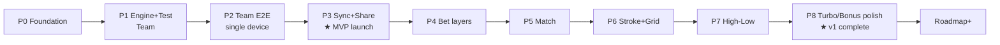

# 06 — Roadmap & Milestones

**Project:** YorDor
**Version:** 0.1 (draft)
**Last updated:** 2026-06-20
**บริบท:** ทำคนเดียว (solo) · ปล่อย Team mode ก่อน แล้วค่อยเพิ่มโหมด · deploy Railway

> หลักวาง milestone: **ทำทีละส่วน ปล่อยได้จริงทุก phase** (vertical slice) ไม่ build ทุกอย่างก่อนเปิด
> ลำดับสำคัญ: **engine + golden test มาก่อน UI เสมอ** (logic ผิดแก้แพงสุด)

---

## ภาพรวมเฟส

---

## P0 — Foundation
**เป้า:** โครงพร้อม deploy ได้

- ตั้งโปรเจกต์ T3 (Next.js App Router + tRPC v11 + Prisma + TypeScript)
- Postgres บน Railway + `DATABASE_URL`
- Prisma schema จาก `03` + migration แรก
- โครง monorepo: `apps/web` + `packages/engine`
- CI เบาๆ (typecheck + test) + deploy Railway

**Done when:** push แล้ว deploy ขึ้น, หน้าเปล่าเปิดได้, `prisma migrate` ผ่าน

---

## P1 — Engine + Golden Test (Team)
**เป้า:** logic ถูกก่อนแตะ UI

- `packages/engine`: `net()`, `bonusMult()`, `turboMult()`, `teamRanked()`, `computeTeam()` ตาม `02`
- **แก้ bug จาก prototype:** `net = strokes − handicap`
- เขียน golden test จาก `07` (Team + invariants zero-sum/determinism)

**Done when:** เคส Team ใน `07` ผ่านครบ + invariants ผ่าน

---

## P2 — Team Mode End-to-End (single device)
**เป้า:** เล่น Team mode จบรอบได้ บันทึกลง DB

- tRPC: `round.create/get`, `player.*`, `hole.setPar/setTurbo`, `score.set/setMany`
- UI: หน้าแรก → setup → handicap → play (per-hole) → result
- เชื่อม engine คำนวณสด (client preview + `result.get`)
- persist ทุกอย่างลง Postgres

**Done when:** สร้างรอบ กรอก 18 หลุม 2 ทีม เห็นผล + matrix ถูกต้อง, reload แล้วข้อมูลอยู่

---

## P3 — Sync + Share ★ MVP LAUNCH (Team only)
**เป้า:** ปล่อยให้ก๊วนใช้จริง

- `accessToken` + หน้าแชร์ลิงก์ + QR + localStorage รอบล่าสุด
- realtime: `round.live` (SSE) + polling fallback + optimistic `score.set`
- indicator ออนไลน์/ซิงก์
- จัดการ FINISHED/แก้สกอร์

**Done when:** 2 เครื่องเปิดลิงก์เดียวกัน กรอกพร้อมกัน เห็น update สด → **เปิดให้ก๊วนทดลอง**

---

## P4 — Bet Layers Infrastructure
**เป้า:** รองรับหลายเดิมพันต่อรอบ (ยังไม่เพิ่มโหมด)

- `Bet`, `Team`, `BetPlayer` + `bet.*` procedures + config validation (`04` §5)
- refactor Team mode เดิมให้เป็น "Bet แรก" (mode=TEAM)
- เพิ่มสเตป "เดิมพัน" + sheet เพิ่ม/แก้ bet (`05` §5)
- aggregate หลาย bet (`02` §8) — ตอนนี้ยังมี bet เดียว แต่โครงพร้อม

**Done when:** Team mode ทำงานผ่านระบบ Bet ใหม่ ไม่ regress

---

## P5 — Match Play
**เป้า:** โหมดที่สอง + พิสูจน์ว่า bet layers ใช้ได้จริง

- engine: `computeMatchHoles()` + `computeMatchStroke()` + golden test
- UI: bet sheet โหมดแมตช์ (จับคู่, นับหลุม/สกอร์รวม, net/gross)
- เล่น Team + Match ส่วนตัวซ้อนในรอบเดียว เห็นผลแยก

**Done when:** เคส Match ใน `07` ผ่าน + เล่นซ้อน Team ได้

---

## P6 — Stroke Play + Scorecard Grid
**เป้า:** โหมดเดี่ยว + มุมมองตาราง

- engine: `computeStroke()` (net+gross leaderboard, round-robin) + test
- UI: มุมมอง scorecard grid (`05` §7) สลับกับ per-hole
- leaderboard net/gross

**Done when:** เคส Stroke ผ่าน + สลับมุมมองกรอกได้ทั้งคู่

---

## P7 — High-Low (บ๊วยจ่ายหัว)
**เป้า:** โหมดที่สี่

- engine: `computeHighLow()` (รายหลุม บ๊วยจ่ายหัว, รองรับเสมอหลายคน) + test
- UI: bet sheet โหมดบ๊วยจ่ายหัว

**Done when:** เคส High-Low ใน `07` ผ่าน (รวมเคสเสมอ)

---

## P8 — Turbo / Bonus Polish ★ v1 COMPLETE
**เป้า:** ปิด v1 ครบ 4 โหมด + modifier

- Turbo toggle ครบทุกโหมด (รายหลุม + สกอร์รวมตามนิยาม `02`)
- Bonus (Birdie/Eagle/Albatross ×5) แสดงผล breakdown สวยงาม
- ทบทวน edge cases + invariants ทุกโหมด
- QA รอบใหญ่: เล่นจริง 18 หลุม หลาย bet หลาย device

**Done when:** ทุกโหมด + Turbo + Bonus ผ่าน golden test และเล่นจริงไม่มี bug → **v1 สมบูรณ์**

---

## Roadmap+ (หลัง v1)

| รายการ | เหตุผล/หมายเหตุ |
|---|---|
| **Skin mode** | per-hole pot + carry-over (`01` §9) |
| **User accounts** | claim รอบ guest → เก็บประวัติข้ามรอบ (`03` §7) |
| **ประวัติ/สถิติ** | leaderboard ส่วนตัว, handicap เฉลี่ย |
| **Standard handicap index** | stroke index ต่อหลุมแบบ WHS แทนต่อ par |
| **Nassau / Stableford** | โหมดยอดนิยมเพิ่ม |
| **Scale realtime** | in-memory emitter → Postgres LISTEN/NOTIFY หรือ Redis เมื่อหลาย instance |
| **Course library** | บันทึก par/turbo ของสนามไว้ reuse |
| **แปลง point → เงิน (optional)** | ถ้าตัดสินใจเพิ่มทีหลัง (v1 ไม่แตะ) |

---

## ความเสี่ยง / โน้ตสำหรับ solo

- **อย่าข้าม P1** — ถ้า engine ผิดตั้งแต่แรก ทุก phase ถัดไปสะสมหนี้ (ดู `02` §10 invariants)
- **Realtime (P3)** ซับซ้อนสุดในช่วงต้น — ถ้าติดนาน ปล่อย MVP แบบ polling อย่างเดียวไปก่อนได้ (subscription เพิ่มทีหลัง)
- **bet layers (P4)** เป็น refactor จุดเปลี่ยน — ทำตอน Team นิ่งแล้วเท่านั้น
- แต่ละ phase ควร **มีของให้เล่นได้จริง** เพื่อกัน burnout และได้ feedback เร็ว
