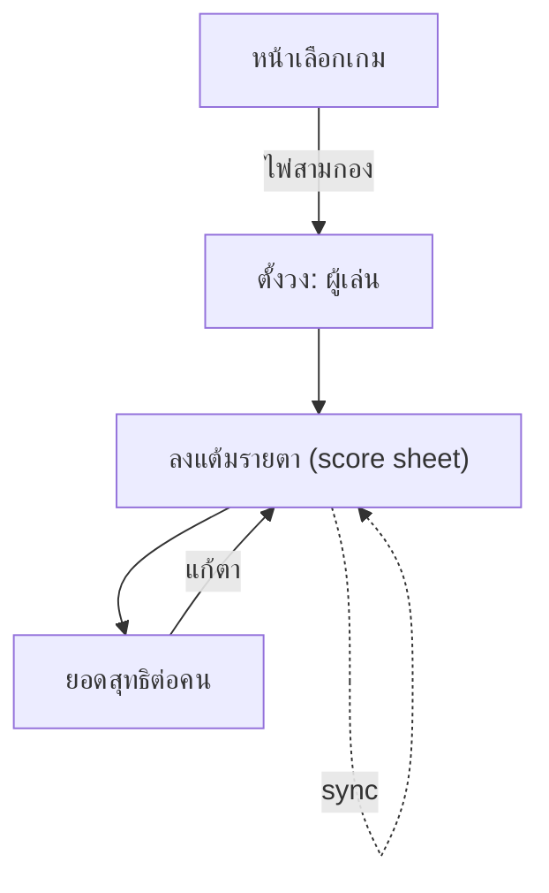

# CARD — ไพ่สามกอง (Zero-Sum Score Sheet)

**Project:** YorDor
**Game type:** `CARD3`
**Version:** 0.1 (draft)
**Last updated:** 2026-06-27
**สถานะ:** เกมที่สองในหน้าเลือกเกม (ถัดจาก Best 1 Best 2)

> เกมนับแต้มไพ่สามกองแบบ **กรอกมือล้วน** — แต่ละตา (hand) กรอกแต้มของทุกคน
> **กติกาเหล็ก: ผลรวมแต้มทุกคนในตาหนึ่ง ต้อง = 0 เสมอ** (block บันทึกจนกว่าจะ = 0)
> ใช้โครงสร้างเดิมร่วมกับกอล์ฟ: Round / accessToken (guest) / realtime sync / รอบล่าสุด localStorage

---

## 1. ภาพรวม

- ผู้เล่นเล่นไพ่กันเอง (แอปไม่คำนวณไพ่) จบแต่ละตาก็มากรอกแต้มที่ได้/เสีย
- แต้มเป็นจำนวนเต็ม **บวก = ได้, ลบ = เสีย**
- ทุกตาเป็น zero-sum: คนได้รวม = คนเสียรวม → `Σ = 0`
- สะสมข้ามหลายตา → ยอดสุทธิต่อคนตอนจบ (ก็ยังเป็น zero-sum)

> ทำไม manual: ไพ่สามกองมี variant การคิดแต้มหลายแบบ (กอง/ตอง/ฟาวล์/ชนะสามกอง ฯลฯ) การกรอกมือทำให้รองรับทุกบ้านกติกาโดยไม่ผูก logic

---

## 2. กติกา (ภาษาคน)

1. ตั้งวง: ใส่รายชื่อผู้เล่น (2+ คน)
2. แต่ละตา: กรอกแต้มที่แต่ละคนได้ในตานั้น (ติดลบได้)
3. **ก่อนกดบันทึกตา ระบบเช็คว่าผลรวม = 0** ถ้าไม่ใช่ → บันทึกไม่ได้ + โชว์ส่วนต่างที่ยังขาด
4. กรอกตาถัดไปเรื่อยๆ
5. ดูยอดสะสม (running total) ได้ตลอด
6. จบเกม → สรุปยอดสุทธิต่อคน

> ไม่มี handicap, ไม่มี par, ไม่มี bonus/turbo, ไม่มี bet layers — เกมนี้เรียบง่าย

---

## 3. Logic Spec

```
// แต่ละตา
validHand(points[]):           // points = แต้มของผู้เล่นทุกคนในตานั้น
    return sum(points) === 0    // เงื่อนไขบันทึก

// ทั้งเกม
computeCard3(players, hands):
    totals[p] = 0
    for hand in hands:
        assert sum(hand.points[*]) === 0     // invariant (กันข้อมูลเพี้ยน)
        for p in players: totals[p] += hand.points[p]
    return { totals, handLog }
```

- `totals[p]` = ยอดสุทธิสะสม (+ ได้ / − เสีย)
- **Invariant:** `Σ totals[*] === 0` เสมอ (สืบทอดจากทุกตาที่ = 0)
- ช่องที่ยังไม่กรอกในตาที่กำลังร่าง = 0 ชั่วคราว แต่จะบันทึกไม่ได้จนกว่าจะ balance

### Settlement (optional)
ยอดสุทธิต่อคนคือผลแล้ว ไม่ต้องมี matrix ก็ได้ ถ้าจะโชว์ "ใครจ่ายใคร" ใช้ greedy:
จับคนยอดบวกมากสุดกับคนยอดลบมากสุดหักกลบไปเรื่อยๆ จนหมด (แสดงเป็นคำแนะนำการเคลียร์)

---

## 4. Data Model (เพิ่มจาก `03_DATABASE_SCHEMA.md`)

ใช้ `Round` + `Player` เดิม เพิ่ม `gameType` กับ 2 ตารางใหม่

```prisma
enum GameType {
  GOLF       // Best 1 Best 2 (และโหมดกอล์ฟอื่นในอนาคต)
  CARD3      // ไพ่สามกอง
}

model Round {
  // ...ของเดิม...
  gameType GameType @default(GOLF)   // migration: rows เดิม = GOLF
  cardHands CardHand[]
}

model CardHand {
  id        String      @id @default(cuid())
  roundId   String
  index     Int         // ตาที่ 1..N
  createdAt DateTime    @default(now())

  round  Round        @relation(fields: [roundId], references: [id], onDelete: Cascade)
  scores CardScore[]

  @@unique([roundId, index])
  @@index([roundId])
}

model CardScore {
  id       String @id @default(cuid())
  roundId  String
  handId   String
  playerId String
  points   Int    // บวก=ได้ ลบ=เสีย

  round  Round    @relation(fields: [roundId], references: [id], onDelete: Cascade)
  hand   CardHand @relation(fields: [handId], references: [id], onDelete: Cascade)
  player Player   @relation(fields: [playerId], references: [id], onDelete: Cascade)

  @@unique([handId, playerId])
  @@index([roundId])
  @@index([handId])
}
```

> Player เดิมมี field handicap (golf) — เกมไพ่ไม่ใช้ ปล่อย default 0 ได้ ไม่ต้องแก้
> ต่างจากกอล์ฟ: ไพ่บันทึกทั้ง "ตา" พร้อมกัน (atomic) ไม่ใช่ cell-level เพราะต้องเช็ค sum=0 ทั้งตา

---

## 5. API (เพิ่มใน `04_API_DESIGN.md`)

| Procedure | Type | หน้าที่ |
|---|---|---|
| `round.create` | mutation | รับ `gameType` เพิ่ม (default GOLF) |
| `card.addHand` | mutation | สร้างตาใหม่ + บันทึกแต้มทุกคน — **validate Σ=0** |
| `card.updateHand` | mutation | แก้แต้มของตาเดิม — **validate Σ=0** |
| `card.removeHand` | mutation | ลบตา |
| `card.getResult` | query | totals + handLog (หรือรวมใน `round.get` เมื่อ gameType=CARD3) |

```ts
// card.addHand
input: z.object({
  token: z.string(),
  scores: z.array(z.object({ playerId: z.string(), points: z.number().int() })),
})
.refine(d => d.scores.reduce((s,x)=>s+x.points,0) === 0, { message: "ผลรวมต้องเป็น 0" })
// → ถ้า refine ไม่ผ่าน ตอบ BAD_REQUEST (นี่คือ block ฝั่ง server)
```

- ทุก mutation bump `Round.updatedAt` → ยิง `round.live` (sync เดิม)
- client ก็เช็ค sum=0 ก่อน (disable ปุ่มบันทึก) แต่ server เป็นด่านสุดท้าย

---

## 6. UI Flow



### หน้าลงแต้มย่อย (per-hand) — แบ่งจอ 2×2 (4 quadrant)
จอแบ่ง **4 ส่วนเท่าๆ กัน** ผู้เล่น 1 คน/ส่วน ช่องใหญ่ กดกรอกถนัดด้วยนิ้วโป้งทั้งสองมือ

```
┌─────────────┬─────────────┐
│   เอ         │   บี         │
│  ┌───────┐   │  ┌───────┐   │
│  │  +30  │   │  │  -10  │   │   ← ช่องเลขใหญ่
│  └───────┘   │  └───────┘   │
│  [ − ][ + ]  │  [ − ][ + ]  │   ← ปุ่มเพิ่ม/ลด + คีย์เลข
├─────────────┼─────────────┤
│   ซี         │   ดี         │
│  ┌───────┐   │  ┌───────┐   │
│  │  -20  │   │  │   0   │   │
│  └───────┘   │  └───────┘   │
│  [ − ][ + ]  │  [ − ][ + ]  │
├─────────────┴─────────────┤
│ ตาที่ 5 · รวม = 0 ✓ [บันทึก]│  ← bar ล่าง: ปุ่มเปิดเมื่อ Σ=0
└───────────────────────────┘   (ถ้า ≠0 โชว์ "ขาด/เกิน X" ปุ่มเทา)
```

- **layout:** 4 quadrant (2×2) — เหมาะผู้เล่น 4 คนพอดี
- **2–3 คน:** เติม quadrant เท่าที่มี (ช่องว่างซ่อน หรือขยายช่องที่เหลือ)
- **5+ คน:** เกิน 4 → 2×2 หน้าแรก + ปัด/หน้าถัดไป หรือ fallback เป็น list (ดู §8 task)
- ช่องกรอกรับเลขลบ (ปุ่ม `−`/`+` ปรับทีละ 1 หรือแตะช่องพิมพ์ตรง)
- bar ล่างแสดง "รวม = X" สด · ปุ่มบันทึกเทาจนกว่า Σ=0 (block ตาม decision)

### หน้า score รวม (grid) — แถบสีทุก 13 ตา
แถว = ตา (เกม), คอลัมน์ = ผู้เล่น, **สลับแถบสีเข้ม/อ่อนทุก 13 ตา** (แบ่งเป็นชุดละ 13 มองง่าย)

```
┌─────┬─────┬─────┬─────┬─────┐
│ ตา  │ เอ  │ บี  │ ซี  │ ดี  │
├─────┼─────┼─────┼─────┼─────┤
│  1  │ +30 │ -10 │ -20 │  0  │ ░ ชุด 1
│  2  │ ... │     │     │     │ ░ (ตา 1–13
│ ... │     │     │     │     │ ░  สีอ่อน)
│ 13  │     │     │     │     │ ░
├─────┼─────┼─────┼─────┼─────┤
│ 14  │     │     │     │     │ ▓ ชุด 2
│ ... │     │     │     │     │ ▓ (ตา 14–26
│ 26  │     │     │     │     │ ▓  สีเข้ม)
├─────┼─────┼─────┼─────┼─────┤
│ 27  │     │     │     │     │ ░ ชุด 3 ...
├─────┼─────┼─────┼─────┼─────┤
│ รวม │+120 │ -40 │ -80 │  0  │ ← ยอดสุทธิ Σ=0
└─────┴─────┴─────┴─────┴─────┘
```

- แถบสีสลับตามสูตร `band = floor((index-1) / 13) % 2` → 0=อ่อน, 1=เข้ม
- เส้นคั่นหนาทุกจบชุด 13 (ขอบล่างของตา 13, 26, 39...)
- แตะแถว = แก้ตานั้น (เปิดหน้าลงแต้มย่อย) · เลื่อนแนวตั้งดูครบ
- แถวล่างสุด "รวม" ปักหมุด (sticky) โชว์ยอดสุทธิต่อคน + ยืนยัน Σ=0

### หน้าผล
```
┌────────────────────────────┐
│ สรุป (12 ตา)                │
│  #1 เอ   +120               │
│  #2 ซี   −40                │
│  #3 บี   −80                │
│  Σ = 0 ✓                    │
│                            │
│ แนะนำเคลียร์ (optional)      │
│  บี จ่าย เอ 80              │
│  ซี จ่าย เอ 40              │
└────────────────────────────┘
```

---

## 7. Test Cases (golden)

### C1 — ตาเดียว 3 คน (valid)
**Input:** [เอ +30, บี −10, ซี −20]
**Expected:** บันทึกได้ · totals = {เอ:+30, บี:−10, ซี:−20} · Σ=0

### C2 — ผลรวมไม่ใช่ 0 (reject)
**Input:** [เอ +30, บี −10, ซี −10]  (รวม +10)
**Expected:** `card.addHand` ตอบ BAD_REQUEST "ผลรวมต้องเป็น 0" · ไม่บันทึก

### C3 — สะสมหลายตา
**Input:** ตา1 [เอ+50, บี−50] · ตา2 [เอ−20, บี+20]
**Expected:** totals = {เอ:+30, บี:−30} · Σ=0

### C4 — 4 คนมีคนได้/เสียหลายคน
**Input:** [เอ +60, บี +20, ซี −30, ดี −50]
**Expected:** บันทึกได้ (Σ=0) · totals ตามนั้น

### C5 — แก้ตาเดิม
**Input:** updateHand ตา1 จาก [เอ+50,บี−50] → [เอ+40,บี−40]
**Expected:** totals อัปเดต · ยัง Σ=0 · ถ้าแก้แล้ว Σ≠0 → reject

### Invariants
- ทุกตาที่บันทึกแล้ว `Σ points = 0`
- `Σ totals = 0` เสมอ
- ลบตา → totals ลดตามตานั้น ยัง Σ=0

---

## 8. Tasks (เพิ่มใน TODO_BUILD.md)

ดูบล็อก **C — ไพ่สามกอง** ที่เพิ่มใน `TODO_BUILD.md`

> หมายเหตุ scope: นี่เป็น **manual zero-sum scorer** ใช้ซ้ำได้กับเกมไพ่อื่นที่ zero-sum
> (เช่น ดัมมี่/ป๊อกเด้งแบบนับแต้มเอง) แค่เปลี่ยนชื่อ — engine เดียวกัน
